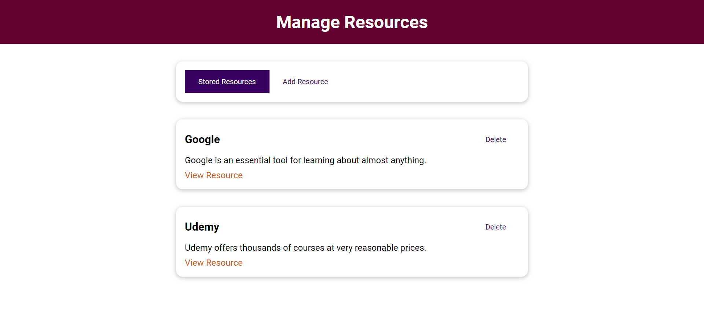

This repository covers fundamental Vue.js concepts including best practices for styling, utilization of props, provide/inject properties and methods, event emissions, slot usage (including named slots), computed properties, methods, conditional component rendering, implementation of keep-alive and more.

## Screenshot

